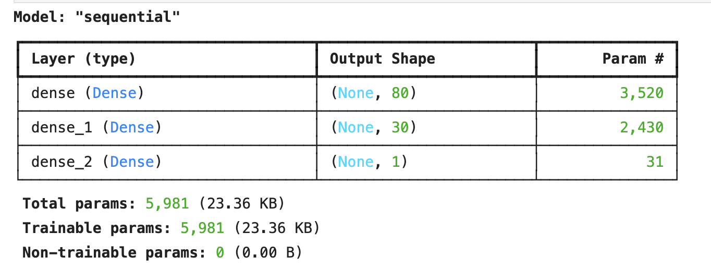
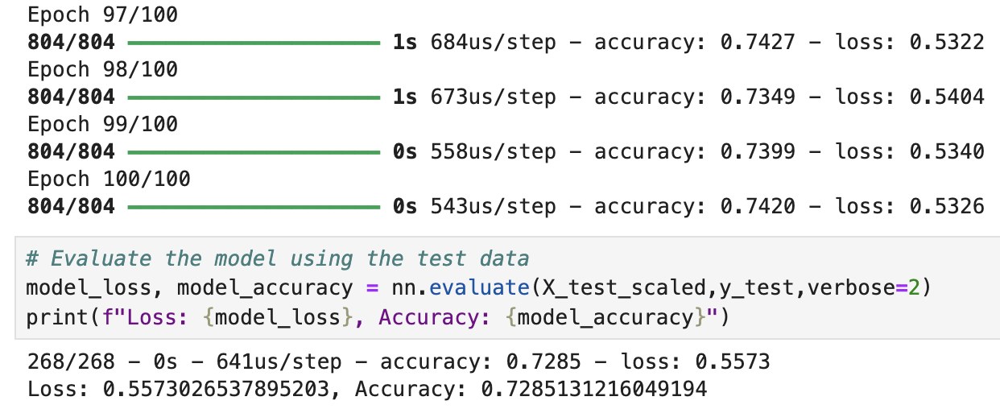
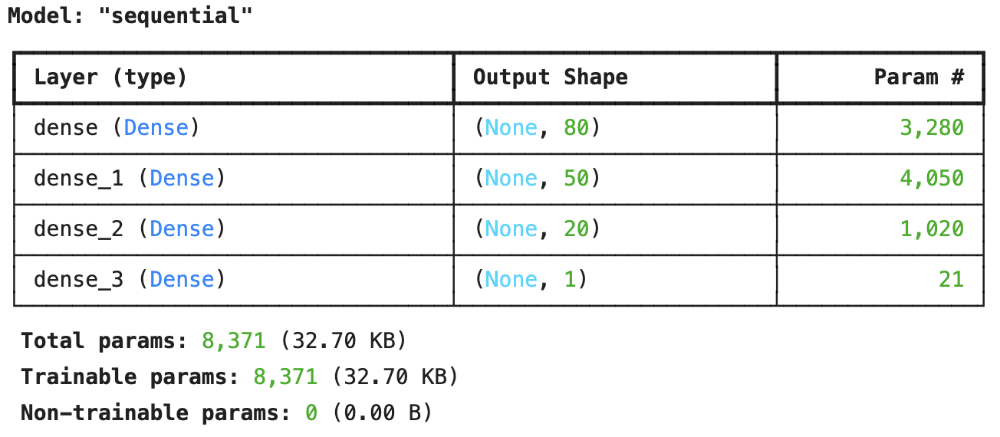
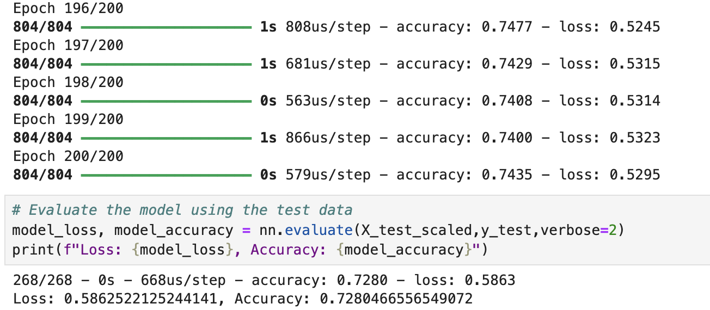
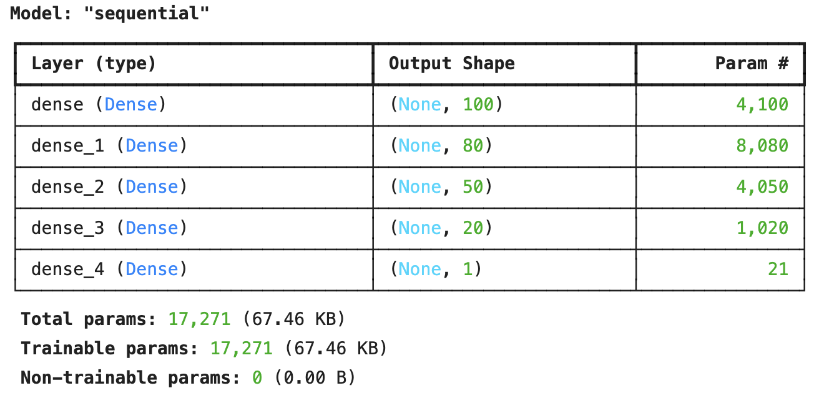
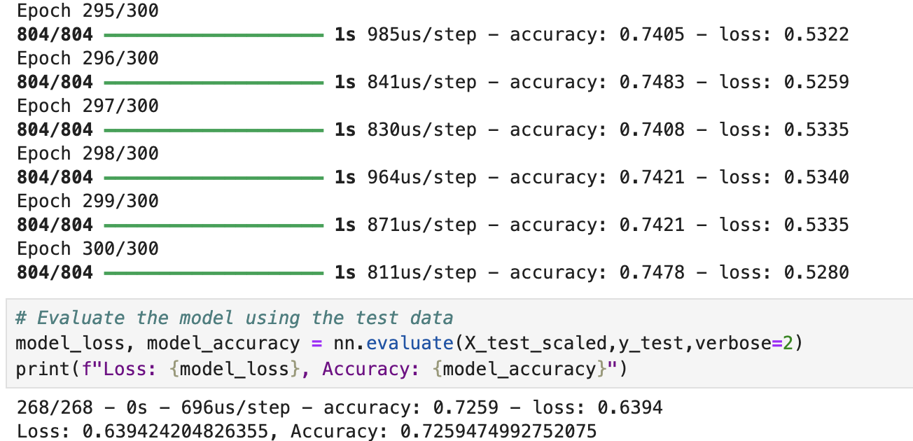
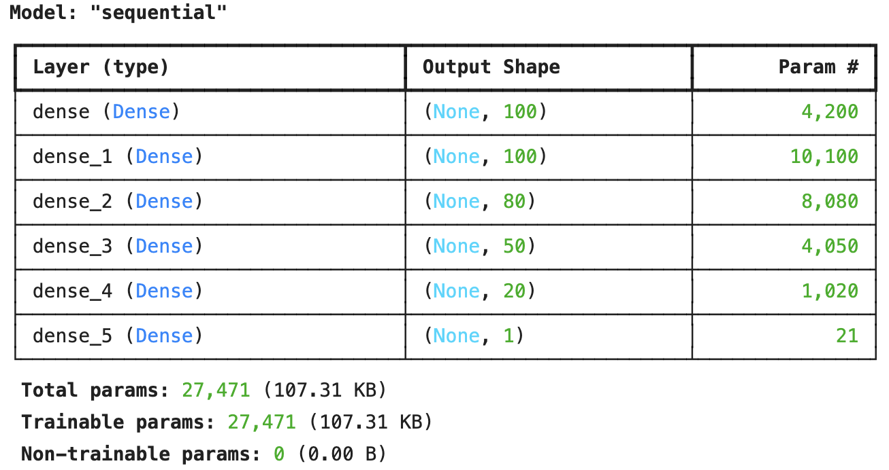
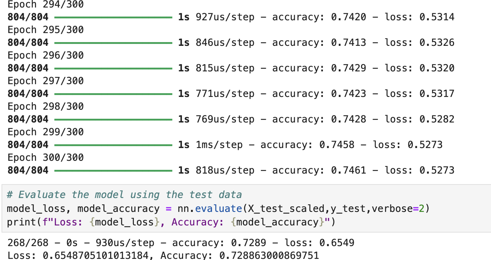

# Deep Learning Challenge

From Module 21: Neural Networks & Deep Learning from the Data Analytics Boot Camp by Monash University and EdX.

By implementing skills learnt throughout the module, an attempt at the challenge has been submitted here.

## Contents

- `Images` folder
  - 8 `.png` files with images used in this README
- `Model_Results` folder
  - `AlphabetSoupCharity.h5` file with first test results
  - `AlphabetSoupCharity_Optimisation_1.h5` file with optimisation attempt 1 (72.8%)
  - `AlphabetSoupCharity_Optimisation_2.h5` file with optimisation attempt 2 (72.5%)
  - `AlphabetSoupCharity_Optimisation_3.h5` file with optimisation attempt 3 (72.8%)
- `AlphabetSoupCharity.ipynb` file with main code
- `AlphabetSoupCharity-Optimisation.ipynb` file for optimisation attempts

## Alphabet Soup Neural Network Model Analysis

### Overview

From BootCamp Spot:

> With your knowledge of machine learning and neural networks, you’ll use the features in the provided dataset to create a binary classifier that can predict whether applicants will be successful if funded by Alphabet Soup.

### Results

#### Data Preprocessing

- As we are trying to predict whether applicants will be successful if funded by Alphabet Soup, the main variable we would want to look at is the `IS_SUCCESSFUL` variable, which denotes whether the funding was used effectively.
- The variables that are the features for the model are:

  - `APPLICATION_TYPE`, Alphabet Soup application type
  - `CLASSIFICATION`, Government organisation classification
  - `AFFILIATION`, Affiliated sector of the industry
  - `USE_CASE`, Use of funding
  - `ORGANIZATION`, Organisation type
  - `STATUS`, Active status of funding
  - `INCOME_AMT`, Income classification
  - `SPECIAL_CONSIDERATIONS`, Special considerations for the application
  - `ASK_AMT`, The amount of funding requested
- `EIN` and `NAME` were removed from the data as they were neither targets nor features.

#### Compiling, Training, and Evaluating the Model

- The initial model had three total layers

  - The hidden layers were given activation `ReLU` because of its effectiveness in dealing with vanishing gradients due to its ability to introduce nonlinearity to the data
  - The output layer was given 1 neuron and activation `sigmoid` as there was only two possible answers; `0` and `1`
  - After training with epoch set to 100, the model recorded an accuracy of 72.8%
  
  - The initial model did not reach target model performance

- Modifications for the first optimisation attempt: **UNSUCCESSFUL**

  - Removed `SPECIAL_CONSIDERATIONS` and `STATUS`
  - Added an additional hidden layer
  
  - After training with epoch set to 200, accuracy remained the same (72.8%)
  

- Modifications for the second optimisation attempt: **UNSUCCESSFUL**

  - Change conditional for replacing application (from 200 to 1000)
  - Added two additional hidden layers
  
  - After training with epoch set to 300, accuracy lowered to 72.5%
  

- Modifications for the third optimisation attempt: **UNSUCCESSFUL**

  - Removed `ASK_AMT`
  - Change number of bins for `APPLICATION_TYPE` and `CLASSIFICATION`

    - For both, binned `Under 100` together and `Under 1000` together

  - Added three hidden layers
  
  - After training with epoch set to 300, accuracy remained the same at 72.8%
  

> Note that all modifications listed are the differences from the initial model, not from the previous optimisation model.

### Summary

Overall, the deep learning model could not achieve the target model performance of 75% despite numerous attempts of modifying the model.

In terms of recommendation of a different model, it may be worthwhile to try the Random Forest model. Neural networks generally need more time to be invested to train the model over the dataset and usually works better with a larger dataset as a result. On the other hand, Random Forest can work with the relatively small dataset we have in this challenge. It is also recommended over something like the Support Vector Machines (SVM) because SVM can only handle two-dimensional data and may not perform well with the extra information of the dataset (i.e., will require a lot of data cleaning and may not be accurate to the type of training that we want). Random Forest is also less prone to overfitting, where it cannot generalise the data and fits to the training data, consequently performing poor with the testing data.

## Credits

All data was given for this challenge and sourced from:

> [IRS. Tax Exempt Organization Search Bulk Data Downloads.](https://www.irs.gov/charities-non-profits/tax-exempt-organization-search-bulk-data-downloads)